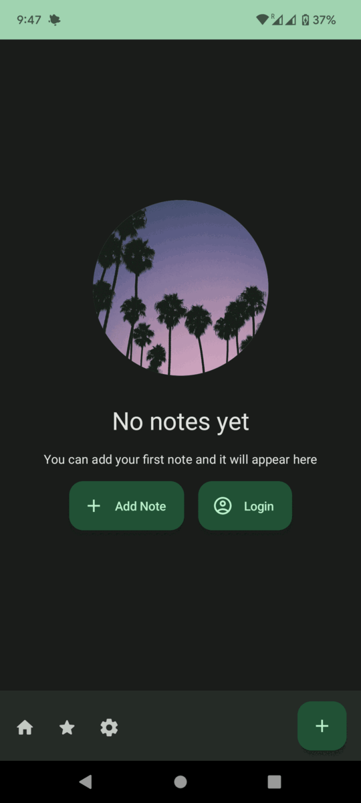

# natai-diary

AI Enhanced Diary application + website built using Kotlin Multiplatform Mobile (KMM), PHP & Symfony on backend, NextJS on frontend, and PostgreSQL as database.

## Development

### Requirements

- [Docker](https://www.docker.com/) && [Docker Compose](https://docs.docker.com/compose/)
- [Kotlin](https://kotlinlang.org/)
- PHP 8.1
- NodeJS 16 & NPM 8
- Makefile support (sudo apt install make)

### Setup

1. Clone the repository
2. Run `make install`
3. Run `make up`

http://localhost:8000/api/doc - Symfony API docs

http://localhost:3000 - Frontend

### Additional services
http://localhost:1080 - MailCatcher

