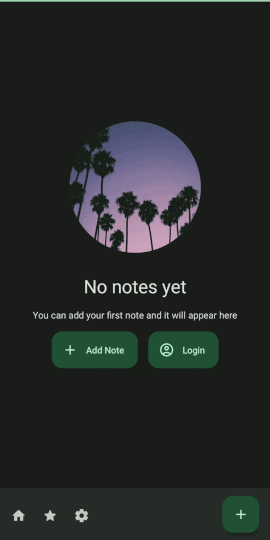

# natai-diary

AI Enhanced Diary application + website built using Jetpack Compose for android, PHP & Symfony on backend, NextJS
on frontend, and PostgreSQL as database.

## Download

[https://natai.app - WEB version](https://natai.app)

## Development

### Requirements

- [Docker](https://www.docker.com/) && [Docker Compose](https://docs.docker.com/compose/)
- [Kotlin](https://kotlinlang.org/)
- PHP 8.1
- Symfony CLI
- NodeJS 16 & npm 8 & npx
- Makefile support (sudo apt install make)
- ngrok (optional, for testing application on real devices using local web server)

### Setup

1. Clone the repository
2. Run `make check` - it will check if all required tools are installed
3. Run `make install` - it will install all required dependencies
4. Run `make up` - it will start all required services (postgres, symfony web server, nextjs frontend)

http://localhost:8000/api/doc - Symfony API docs

http://localhost:3000 - Frontend

### Additional services

http://localhost:1080 - MailCatcher

### Commands

- `make up` - start all services
- `make frontend-schema` - generate react-query hooks + schema from openapi spec
- `make frontend-tunnel` - create ngrok tunnel for frontend
- `stripe listen --forward-to localhost:8000/api/v1/stripe` - start stripe webhook listener
